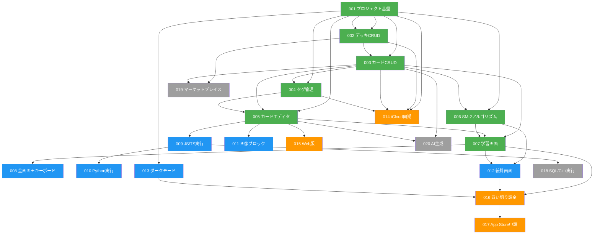

# 000 チケット一覧 & 依存関係図

**フェーズ:** セットアップ
**ステータス:** 完了

---

## Todo

- [x] `docs/` ディレクトリ作成
- [x] フェーズ別チケット一覧表の作成（001〜020）
- [x] 各チケットファイルの作成（001〜020）
- [x] Mermaid 依存関係図の作成（フェーズ別色分け）
- [x] 並行開発可能ラウンド表の作成（MVP）

---

## フェーズ別チケット一覧

| # | チケット名 | フェーズ | ステータス | 依存 |
|---|---|---|---|---|
| [001](./001-project-foundation.md) | プロジェクト基盤（DB・ナビゲーション・i18n） | MVP | 完了 | なし |
| [002](./002-deck-crud.md) | デッキ管理 CRUD | MVP | 完了 | 001 |
| [003](./003-card-crud.md) | カード管理 CRUD | MVP | 完了 | 001, 002 |
| [004](./004-tag-management.md) | タグ管理 | MVP | 完了 | 001, 003 |
| [005](./005-card-editor.md) | カードエディタ（Markdown・ブロック） | MVP | 完了 | 001, 003, 004 |
| [006](./006-sm2-algorithm.md) | SM-2 間隔反復アルゴリズム | MVP | 完了 | 001, 003 |
| [007](./007-study-screen.md) | 学習画面（通常モード） | MVP | 未着手 | 003, 005, 006 |
| [008](./008-fullscreen-keyboard.md) | 全画面モード＋Bluetoothキーボード | v1.0 | 未着手 | 007 |
| [009](./009-code-execution-js.md) | コード実行（JavaScript / TypeScript） | v1.0 | 未着手 | 005 |
| [010](./010-code-execution-python.md) | コード実行（Python / Pyodide） | v1.0 | 未着手 | 009 |
| [011](./011-image-block.md) | 画像ブロック | v1.0 | 未着手 | 005 |
| [012](./012-statistics-screen.md) | 統計画面 | v1.0 | 未着手 | 006, 007 |
| [013](./013-dark-mode-theme.md) | ダークモード＆テーマ | v1.0 | 未着手 | 001 |
| [014](./014-icloud-sync.md) | iCloud 同期（CloudKit） | v1.1 | 未着手 | 001, 002, 003, 004 |
| [015](./015-web-version.md) | Web 版（カード作成専用） | v1.1 | 未着手 | 005 |
| [016](./016-in-app-purchase.md) | 買い切り課金 | v1.1 | 未着手 | 007, 012, 013 |
| [017](./017-app-store-submission.md) | App Store 申請 | v1.1 | 未着手 | 016 |
| [018](./018-code-execution-sql-cpp.md) | コード実行（SQL / C++） | 将来 | 未着手 | 009 |
| [019](./019-deck-marketplace.md) | デッキ マーケットプレイス | 将来 | 未着手 | 002, 003 |
| [020](./020-ai-card-generation.md) | AI カード自動生成 | 将来 | 未着手 | 003, 005 |

---

## 依存関係図

**凡例:**
- 緑 (MVP): Phase 1
- 青 (v1.0): Phase 2
- オレンジ (v1.1): Phase 3
- グレー (将来): Phase 4

---

## 並行開発可能なチケット（MVP）

MVP フェーズで独立して着手できる組み合わせ:

| セッション | 並行実施可能なチケット |
|---|---|
| Round 1 | **001**（基盤）のみ — 全チケットのブロッカー |
| Round 2 | **002**, **013** |
| Round 3 | **003**, **013**（継続） |
| Round 4 | **004**, **006** |
| Round 5 | **005** |
| Round 6 | **007** |

v1.0 以降は 007 完了後に **008 / 009 / 011 / 012 / 013** を並行実施可能。
